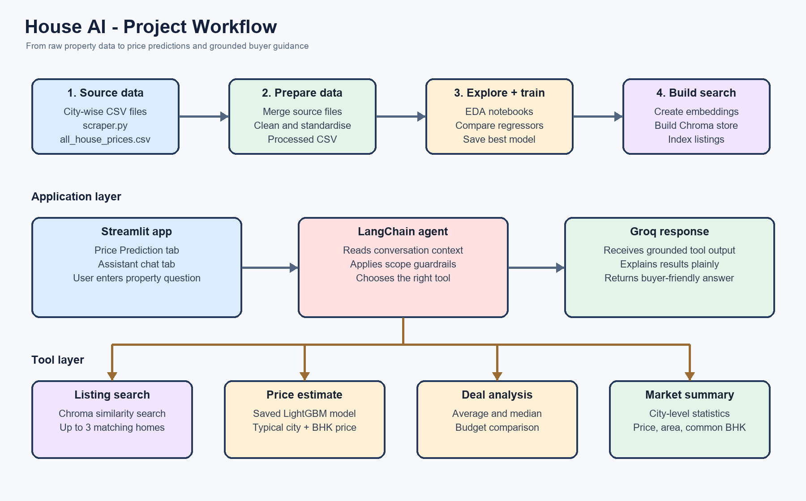

# House AI



House AI is a small property-advisory app built around a practical question: *is this home reasonably priced, and what else should I look at?*

The project combines a house-price regression model with a retrieval-based assistant. The Streamlit interface lets a user either enter property details and get an estimated price, or ask natural-language questions about listings, budgets, cities, and potential deals.

It is intended as a learning project and decision-support tool, not as a replacement for a property inspection, valuation, or professional financial advice.

## Project description

Buying a home usually involves jumping between several kinds of information: asking prices, property features, comparable listings, and rough market expectations. House AI brings those pieces into one simple interface. A user can enter the basic details of a property, see an estimated price, and then ask follow-up questions in the same app.

The main idea was to make the output useful to a buyer, rather than just returning a number. The assistant can explain whether a price looks reasonable compared with similar homes, find listings within a budget, and provide a short city-level summary. Its answers are grounded in the property data and the calculations performed by the project tools.

## What we achieved

- Built an end-to-end property analytics application, from raw city-wise datasets to a usable Streamlit interface.
- Cleaned and combined property data so it could be used consistently for analysis, model training, and search.
- Compared multiple regression approaches and selected a LightGBM model for the saved price estimator.
- Added a natural-language assistant that can choose between listing search, price estimation, deal analysis, and city market summaries.
- Added a Chroma vector store with sentence-transformer embeddings for retrieving relevant property listings.
- Added simple guardrails so the assistant stays within the property-advisory scope.
- Designed the response instructions to keep listing facts tied to retrieved data and to explain them in plain language.
- Created a complete local workflow that can be explored through notebooks and then used through the app.

The result is a working prototype that connects machine learning, retrieval, tool calling, and a user-facing application in one project. It is also structured so that the data preparation and modelling work can be inspected separately from the final assistant experience.

## What it does

- Predicts an estimated property price in INR lakh from details such as city, area, BHK, bathrooms, parking, furnishing, and ownership.
- Searches the local property dataset for matching listings.
- Compares a user's price or budget with comparable properties.
- Provides simple city-level summaries, including median price, average price, typical area, and common BHK.
- Keeps the assistant focused on property-related questions through basic query guardrails.
- Uses retrieved listing data as the source for property facts, so the assistant does not need to invent listing details.

## A quick look at the app

The app has two tabs:

1. **Price Prediction** - fill in the property details and get a predicted price and price segment.
2. **Assistant** - ask questions such as:

   ```text
   Find a 2 BHK in Pune under 80 lakh.
   Is 92 lakh for a 2 BHK in Pune a good deal?
   Give me a market summary for Mumbai.
   ```

## How the pieces fit together

```text
City-wise CSV files
        |
        v
Cleaned property dataset -----> trained regression model -----> Price Prediction tab
        |
        +----------------------> Chroma vector store ----------> listing search
        |
        +----------------------> market/deal tools ------------> House AI assistant
                                                                  |
                                                                  v
                                                              Groq model
```

The assistant uses LangChain tool calling. Depending on the question, it can search listings, estimate a typical price, check a deal against comparable prices, or return a city summary. Chroma stores the searchable listing context, while the saved regression model is used for price estimates.

## Project structure

```text
.
├── app.py                         Streamlit application
├── scraper.py                     Data collection helper
├── requirements.txt               Python dependencies
├── data/
│   ├── *_House_Price.csv          City-wise source data
│   ├── merge_data.py              Combine source files
│   ├── rebuild_clean_csv.py       Rebuild the cleaned dataset
│   └── processed/                 Generated cleaned data
├── models/
│   └── best_regression_model_metadata.json
├── notebooks/
│   ├── 01_eda_and_data_cleaning.ipynb
│   └── 02_regression_price_prediction.ipynb
├── rag/
│   ├── agent.py                    Groq agent and prompt
│   ├── tools1.py                   Search, deal, and market tools
│   ├── retriever.py                Chroma and embedding setup
│   ├── build_store.py              Vector-store builder
│   └── guardrails.py               Query scope checks
└── vector_store/                  Generated Chroma data
```

## Local setup

This project uses Python 3.11+.

```bash
git clone <your-repository-url>
cd House-AI-Agentic-RAG-Property-Advisor-using-LangChain-and-Groq

python -m venv .venv
# Windows
.venv\Scripts\activate
# macOS/Linux
# source .venv/bin/activate

pip install -r requirements.txt
```

Create a `.env` file in the project root:

```env
GROQ_API_KEY=your_groq_api_key
GROQ_MODEL=openai/gpt-oss-120b
```

Do not commit `.env` or any API key.

## Running the app

```bash
streamlit run app.py
```

Open the local URL shown by Streamlit, usually `http://localhost:8501`.

The app expects these generated files to be present:

- `data/processed/simple_house_properties_clean.csv`
- `models/best_regression_model.joblib`
- `vector_store/simple_property_chroma/`

On a fresh clone, rebuild the cleaned data and vector store using the scripts in `data/` and `rag/`, then run the regression notebook to create the saved model. The exact order is:

1. Run `data/merge_data.py` if the combined dataset needs to be rebuilt.
2. Run `data/rebuild_clean_csv.py` to create the processed CSV.
3. Run `notebooks/02_regression_price_prediction.ipynb` and save the model under `models/`.
4. Run `rag/build_store.py` to create the Chroma store.
5. Start Streamlit with the command above.

## Project workflow

The diagram shows how the source data moves through cleaning, model training, vector-store creation, and finally into the Streamlit application. In the assistant flow, LangChain routes the user's question to the relevant property tool, while Groq turns the tool result into a short buyer-friendly response.


## Model notes

The training notebook compares several regression approaches, including linear models, histogram gradient boosting, XGBoost, LightGBM, and CatBoost. The saved best model is a `LGBMRegressor` trained on `log1p(price_lakh)` and converted back to lakh using `expm1`.
